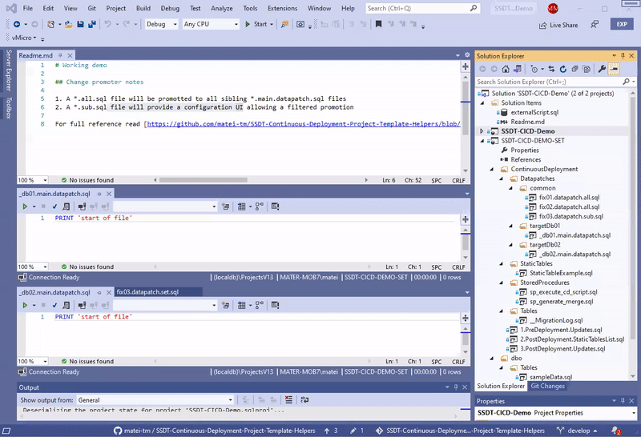

# SSDT-Continuous-Deployment-Project-Template-Helpers

- [SSDT-Continuous-Deployment-Project-Template-Helpers](#ssdt-continuous-deployment-project-template-helpers)
- [The quick wrapper command for datapatches](#the-quick-wrapper-command-for-datapatches)
  - [Constraints to qualify for wrapping](#constraints-to-qualify-for-wrapping)
- [The change promoter of common datapatches to sibling folders that aggregates the fixes for different deployments](#the-change-promoter-of-common-datapatches-to-sibling-folders-that-aggregates-the-fixes-for-different-deployments)
  - [How it works](#how-it-works)
  - [Promoting  "\*.all.sql" files.](#promoting--allsql-files)
    - [Demo](#demo)
    - [Constraints for a valid ALL promotion](#constraints-for-a-valid-all-promotion)
  - [Promoting  "\*.sub.sql" files.](#promoting--subsql-files)
    - [Demo](#demo-1)
    - [Constraints for a valid FILTERED SUBset promotion](#constraints-for-a-valid-filtered-subset-promotion)
    - [Advantages](#advantages)
- [Requirements](#requirements)
- [Installation](#installation)
- [Demo solution](#demo-solution)
  - [Changelog](#changelog)
  - [Disclaimer](#disclaimer)
    - [The datapatch wrapper module updated files](#the-datapatch-wrapper-module-updated-files)
    - [The change promoter updated files](#the-change-promoter-updated-files)

This is a Visual Studio extension that add some helpers to the [SSDT-Continuous-Deployment-Project-Template](https://github.com/RadoslavGatev/SSDT-Continuous-Deployment-Project-Template)

- A quick wrapper command for datapatches
- A change promoter of common datapatches in two flavors
  - adding automatic references to all files
  - providing a configuration UI where the user can choose the promotion destinations

# The quick wrapper command for datapatches

In order to capture changes into the migration table a datapatch should be applied through **sp_execute_cd_script**. Using the quick wrapper the user can create a datapatch as a plain script with DML statements (INSERT/UPDATE/DELETE) and transform it as parameter to **sp_execute_cd_script**

## Constraints to qualify for wrapping

- the file must be opened in the current document tab
- the file must be part of a SSDT Database project
- the file should have a sql extension
- the file must have DML statements (INSERT/UPDATE/DELETE)
- if it was wrapped already it will not be applied twice

# The change promoter of common datapatches to sibling folders that aggregates the fixes for different deployments

If the base schema is distributed to several independent databases, this tool will help promoting the datapatch to several sibling folders. It will help to add a SQLCMD reference of the selected script to the needed matching destinations.

## How it works

It works with two naming conventions:

1. A file that is matching "\*.all.sql" will be promoted to all sibling files matching "\*.main.datapatch.sql"
2. A file that is matching "\*.sub.sql" will provide a configuration UI where the user can choose the destination files matching "\*.main.datapatch.sql"

## Promoting  "\*.all.sql" files. 

### Demo

### Constraints for a valid ALL promotion

- the subject to promotion must match "*.all.sql"
- the subject to promotion must be a sql script
- the subject to promotion must have the "Build Action" as "None"
- the destination file must match "*.main.datapatch.sql"
- the destination file must be in a folder of the same level as the subject

## Promoting  "\*.sub.sql" files. 

### Demo

### Constraints for a valid FILTERED SUBset promotion

- the subject to promotion must match "*.sub.sql"
- the subject to promotion must be a sql script
- the subject to promotion must have the "Build Action" as "None"
- the destination file must match "*.main.datapatch.sql"
- the destination file must be in a folder of the same level as the subject
- the destination file must be checked in the "Destination Picker" dialog box 

### Advantages

- the destination files collection can be saved and reused
- alows filtered subset of destination files
- all the files can be checked in a single action
- the "all" collection is protected from changes
- the configuration setup is saved as json file
- the configuration collection are persisted in the current session of VS

# Requirements

1. SSDT Tools 

2. A database project created from the template provided by [SSDT-Continuous-Deployment-Project-Template](https://marketplace.visualstudio.com/items?itemName=SolvSoftware.SSDT-Continuous-Deployment-Project-Template)

# Installation

[Install from the Visual Studio Marketplace](https://marketplace.visualstudio.com/items?itemName=matei-tm.ssdtdatapatchwrapper)

# Demo solution

A demo database project structure can be downloaded from [https://github.com/matei-tm/SSDT-Continuous-Deployment-Project-Template-Helpers/tree/develop/examples/SSDT-CICD-Demo](https://github.com/matei-tm/SSDT-Continuous-Deployment-Project-Template-Helpers/tree/develop/examples/SSDT-CICD-Demo) 

## Changelog

Please see project's [changelog](https://github.com/matei-tm/SSDT-Continuous-Deployment-Project-Template-Helpers/blob/main/CHANGELOG.md) 

## Disclaimer

**Important:** 
This extension, being a code generator, will change files in the targeted database project. Use a suitable source control system (eg, git) to protect your code from transient changes.
 
### The datapatch wrapper module updated files

The helper updates, in the current SSDT project, the current sql file opened in the editor tab of Visual Studio

### The change promoter updated files

The helper updates, in the current SSDT project, all the files matching the pattern "\*.main.datapatch.sql" contained in all the folders that are at the same level (siblings) as the folder that contains the "\*.all.sql" file (the file used for the promotion).

Although I should not overwrite any file, other than those mentioned, during this process, I do not provide any warranty or take any responsibility for the loss of data.