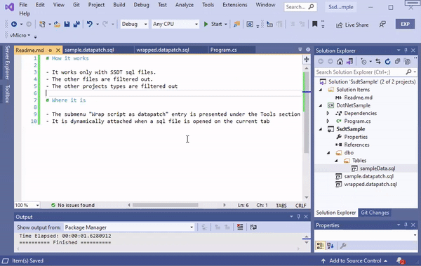
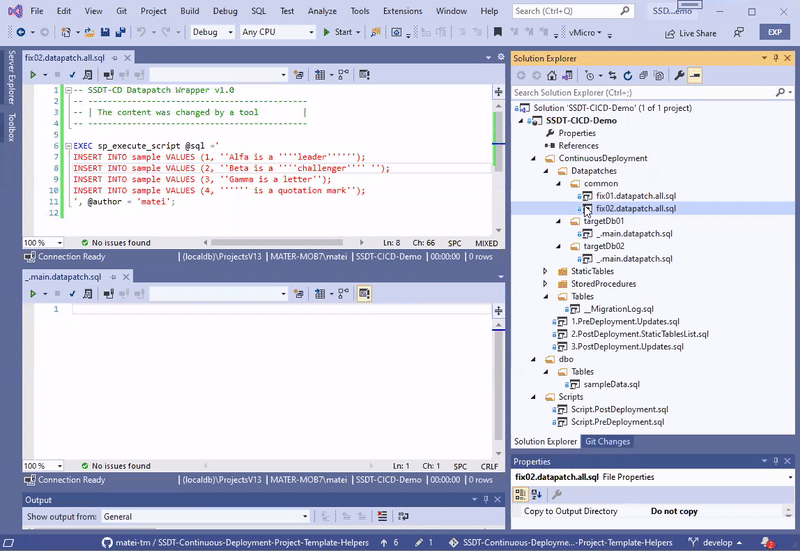
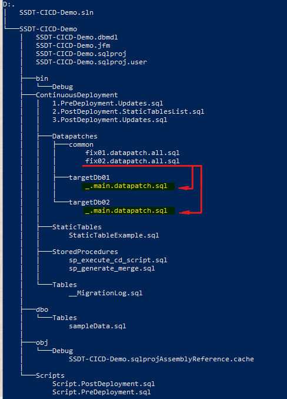
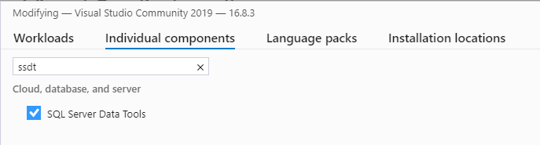

# SSDT-Continuous-Deployment-Project-Template-Helpers

This a Visual Studio extension that add some helpers to the [SSDT-Continuous-Deployment-Project-Template](https://github.com/RadoslavGatev/SSDT-Continuous-Deployment-Project-Template)

- A quick wrapper command for datapatches
- A change promoter of common datapatches

# The quick wrapper command for datapatches

In order to capture changes into the migration table a datapatch should be applied through **sp_execute_cd_script**. Using the quick wrapper the user can create a datapatch as a plain script with DML statements (INSERT/UPDATE/DELETE) and transform it as parameter to **sp_execute_cd_script**

## Constraints to qualify for wrapping

- the file must be opened in the current document tab
- the file must be part of a SSDT Database project
- the file should have a sql extension
- the file must have DML statements (INSERT/UPDATE/DELETE)
- if it was wrapped already it will not be applied twice

# The change promoter of common datapatches to sibling folders that aggregates the fixes for different deployments

If the base schema is distributed to several independent databases, this tool will help promoting the datapatch to several sibling folders. It will add a SQLCMD reference of the selected script to all matching destinations.
It works with a naming convention. All the files that are matching the pattern "*.all.sql" can be promoted to all sibling files matching "*.main.datapatch.sql"

## Constraints for a valid promotion

- the subject to promotion must match "*.all.sql"
- the subject to promotion must be a sql script
- the subject to promotion must have the "Build Action" as "None"
- the destination file must match "*.main.datapatch.sql"
- the destination file must be in a folder of the same level as the subject

# Requirements

1. SSDT Tools 

2. A database project created from the template provided by [SSDT-Continuous-Deployment-Project-Template](https://marketplace.visualstudio.com/items?itemName=SolvSoftware.SSDT-Continuous-Deployment-Project-Template)

# Demo solution

A demo database project structure can be downloaded from [https://github.com/matei-tm/SSDT-Continuous-Deployment-Project-Template-Helpers/tree/develop/examples/SSDT-CICD-Demo](https://github.com/matei-tm/SSDT-Continuous-Deployment-Project-Template-Helpers/tree/develop/examples/SSDT-CICD-Demo) 